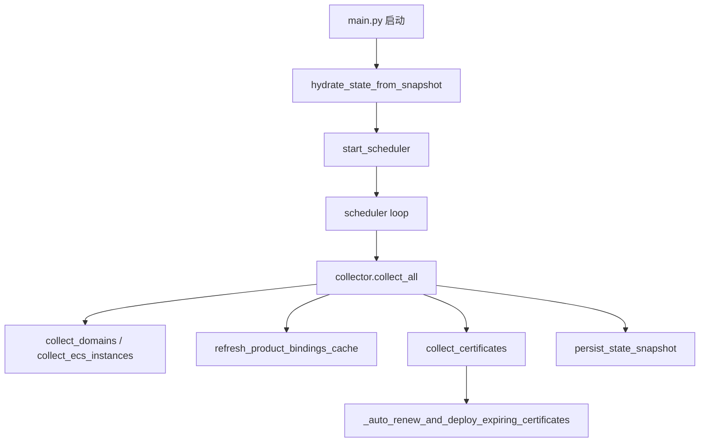
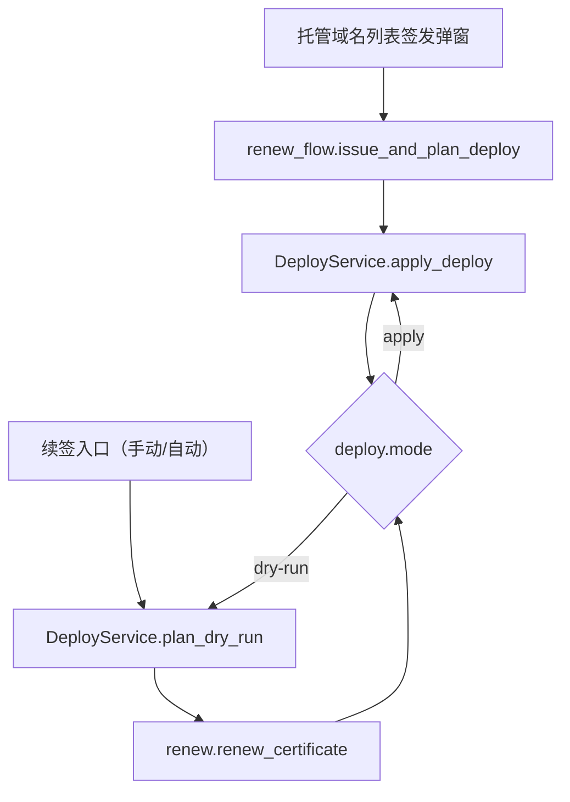

# CRT 运行流程总览

本文只保留运行主流程与关键入口状态，细节见 `flow-services.md` 与 `flow-overview.svg`。
模块职责详见 `services.md` / `providers.md` / `deploys.md`，配置规则详见 `config-rules.md`。

## 1. 调度与采集主流程（简版）

## 2. 签发/续签编排与部署主流程（简版）

## 3. 细节参考

- 采集链路细节：`flow-services.md`
- 总览视角：`flow-overview.svg`
- 部署细节：`deploys.md`

## 4. 当前开关状态

- `refresh_product_bindings_cache()` 已启用，仅刷新 `product_bindings_cache.json`。
- 自动续签编排入口已启用，受 `auto_renew_enabled=true` 与 `auto_renew_days>0` 共同控制。
- UI 的托管域名列表提供可编辑“签发”弹窗，用于本机 acme.sh 首次接管；证书池仅提供“强制续签 / 部署”。
