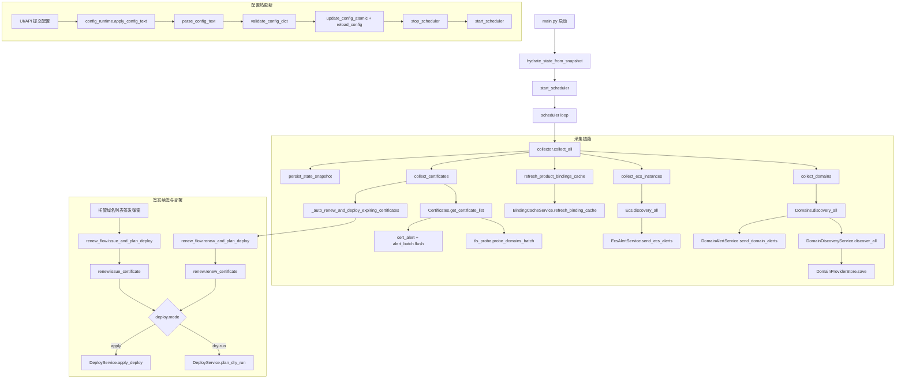

# CRT Services 总流程（大图）

只描述 services 层的主逻辑与关键分支，细节仍以各模块文档为准。

```mermaid
flowchart TD
    A[main.py 启动] --> B[hydrate_state_from_snapshot]
    B --> C[start_scheduler]
    C --> D[scheduler loop]
    D --> E[collector.collect_all]

    subgraph 采集链路
        E --> F[collect_domains]
        F --> G[Domains.discovery_all]
        G --> H[DomainDiscoveryService.discover_all]
        H --> I[DomainProviderStore.save]
        G --> J[DomainAlertService.send_domain_alerts]

        E --> K[collect_ecs_instances]
        K --> L[Ecs.discovery_all]
        L --> M[EcsAlertService.send_ecs_alerts]

        E --> N[refresh_product_bindings_cache]
        N --> O[BindingCacheService.refresh_binding_cache]

        E --> P[collect_certificates]
        P --> Q[Certificates.get_certificate_list]
        Q --> R[tls_probe.probe_domains_batch]
        Q --> S[cert_alert + alert_batch.flush]

        P --> T[_auto_renew_and_deploy_expiring_certificates]
        E --> U[persist_state_snapshot]
    end

    subgraph 签发续签与部署
        Issue[托管域名列表签发弹窗] --> IssueFlow[renew_flow.issue_and_plan_deploy]
        IssueFlow --> IssueCert[renew.issue_certificate]
        IssueCert --> X
        T --> V[renew_flow.renew_and_plan_deploy]
        V --> W[renew.renew_certificate]
        W --> X{deploy.mode}
        X -->|dry-run| Y[DeployService.plan_dry_run]
        X -->|apply| Z[DeployService.apply_deploy]
    end

    subgraph 配置热更新
        CfgA[UI/API 提交配置] --> CfgB[config_runtime.apply_config_text]
        CfgB --> CfgC[parse_config_text]
        CfgC --> CfgD[validate_config_dict]
        CfgD --> CfgE[update_config_atomic + reload_config]
        CfgE --> CfgF[stop_scheduler]
        CfgF --> CfgG[start_scheduler]
    end
```
